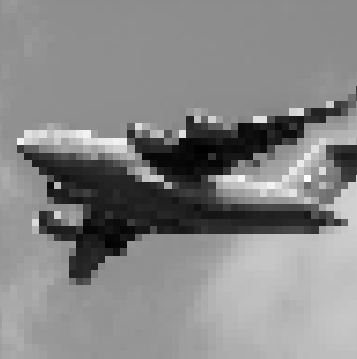
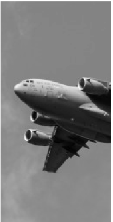
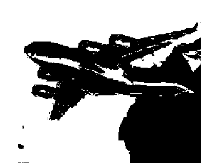
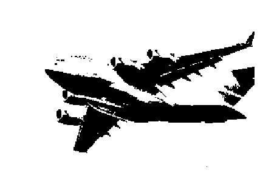
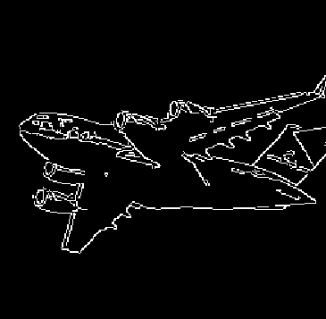
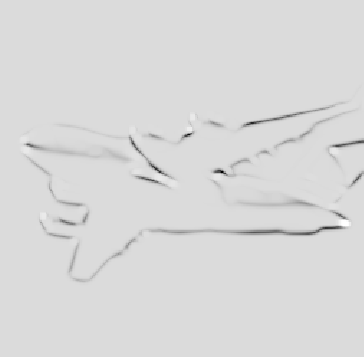
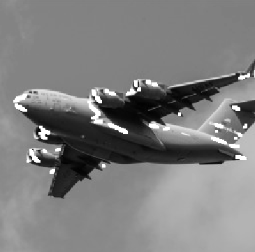
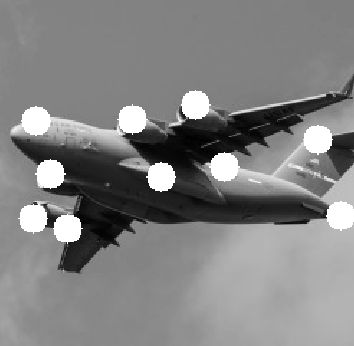

Python

Python机器学习手册
#### 第1章 向量、矩阵和数组
[1.1 创建一个向量](MachingLearning/chapter1/1.1%20vector.py)
[1.2 创建一个矩阵](MachingLearning/chapter1/1.2%20matrix.py)
[1.3 创建一个稀疏矩阵](MachingLearning/chapter1/1.3%20matrix_sparse.py)
[1.5 展示一个矩阵的属性](MachingLearning/chapter1/1.5%20shape_size_ndim.py)

[1.6 对多个元素应用某个操作](MachingLearning/chapter1/1.6%20vectorize.py)
[1.7 找到最大值和最小值](MachingLearning/chapter1/1.7%20max_mix.py)
[1.8 计算平均值、方差和标准差](MachingLearning/chapter1/1.8%20mean_var_std.py)
[1.9 矩阵变形.py](MachingLearning/chapter1/1.9%20reshape.py)

[1.10 转置矩阵](MachingLearning/chapter1/1.10%20T_matrix.py)
[1.10 转置向量](MachingLearning/chapter1/1.10%20T_vector.py)
[1.11 展开一个矩阵](MachingLearning/chapter1/1.11%20flatten.py)
[1.12 计算矩阵的秩](MachingLearning/chapter1/1.12%20matrix_rank.py)
[1.13 计算行列式](MachingLearning/chapter1/1.13%20det.py)
[1.14 获取矩阵的对角线元素](MachingLearning/chapter1/1.14%20diagonal.py)

[1.15 计算矩阵的迹](MachingLearning/chapter1/1.15%20trace.py)
[1.16 计算特征值和特征向量](MachingLearning/chapter1/1.16%20eig.py)
[1.17 计算点积](MachingLearning/chapter1/1.17%20dot-vector.py)
[1.18 矩阵的加减](MachingLearning/chapter1/1.18%20add_subtract.py)
[1.19 矩阵的乘法](MachingLearning/chapter1/1.19%20dot-matrix.py)
[1.20 计算矩阵的逆](MachingLearning/chapter1/1.20%20inv.py)

[1.21 生成随机数](MachingLearning/chapter1/1.21%20random.py)

#### 第2章 加载数据
[2.1  加载样本数据集](MachingLearning/chapter2/2.1%20scikit-learn.py)
[2.2.1 创建仿真数据集](MachingLearning/chapter2/2.2.1%20make_regression.py)
[2.2.2 创建仿真数据集2](MachingLearning/chapter2/2.2.2%20make_classification.py)
[2.2.3 创建仿真数据集3](MachingLearning/chapter2/2.2.3%20make_blobs.py)

[2.3 加载CSV文件](MachingLearning/chapter2/2.3%20read_csv.py)
[2.4 加载Excel文件](MachingLearning/chapter2/2.4%20read_excel.py)
[2.5 加载JSON文件](MachingLearning/chapter2/2.5%20read_json.py)
[2.6 查询SQL数据库](MachingLearning/chapter2/2.6%20read_sql_query.py)

#### 第3章 数据整理
[3.0  加载CSV文件](MachingLearning/chapter3/3.0%20read_csv.py)
[3.1  创建一个数据帧](MachingLearning/chapter3/3.1%20dataframe.py)
[3.2  描述数据](MachingLearning/chapter3/3.2%20dataframe_property.py)
[3.3  浏览数据帧](MachingLearning/chapter3/3.3%20dataframe_iloc.py)
[3.4  根据条件语句来选择行](MachingLearning/chapter3/3.4%20dataframe.py)
[3.5  替换值](MachingLearning/chapter3/3.5%20dataframe_replace.py)

[3.6  重命名列](MachingLearning/chapter3/3.6%20dataframe_rename.py)
[3.7  计算最大值、最小值等](MachingLearning/chapter3/3.7%20dataframe.py)
[3.8  查找唯一值](MachingLearning/chapter3/3.8%20dataframe_unique.py)
[3.9  处理缺失值](MachingLearning/chapter3/3.9%20dataframe_null.py)
[3.10  删除一列](MachingLearning/chapter3/3.10%20dataframe_drop_column.py)

[3.11  删除一行](MachingLearning/chapter3/3.11%20dataframe_drop_row.py)
[3.12  删除重复值](MachingLearning/chapter3/3.12%20dataframe_drop_duplicates.py)
[3.13  根据值对行分组](MachingLearning/chapter3/3.13%20dataframe_groupby.py)
[3.14  按时间段对行分组](MachingLearning/chapter3/3.14%20dataframe_resample.py)
[3.15  遍历一个列的数据](MachingLearning/chapter3/3.15%20dataframe_for.py)

[3.16  对一列的所有元素应用某个函数](MachingLearning/chapter3/3.16%20dataframe_apply.py)
[3.17  对所有分组应用一个函数](MachingLearning/chapter3/3.17%20dataframe_groupby_apply.py)
[3.18  连接多个数据帧](MachingLearning/chapter3/3.18%20dataframe_concatenate.py)
[3.19  合并两个数据帧](MachingLearning/chapter3/3.19%20dataframe_merge.py)

#### 第4章 处理数值型数据
[4.1 特征的缩放](MachingLearning/chapter4/4.1%20MinMaxScaler.py)
[4.2 特征的标准化 ](MachingLearning/chapter4/4.2%20StandardScaler.py)
[4.3 归一化观察值](MachingLearning/chapter4/4.3%20Normalizer.py)
[4.4 生成多项式和交互特征](MachingLearning/chapter4/4.4%20PolynomialFeatures.py)
[4.5 转换特征](MachingLearning/chapter4/4.5%20FunctionTransformer.py)

[4.6 识别异常值](MachingLearning/chapter4/4.6%20Outlier.py)
[4.7 处理异常值](MachingLearning/chapter4/4.7%20Handling_outlier.py)
[4.8 将特征离散化](MachingLearning/chapter4/4.8%20Digitize.py)
[4.9 使用聚类的方式将观察值分组](MachingLearning/chapter4/4.9%20KMean.py)
[4.10 删除带有缺失值的观察值](MachingLearning/chapter4/4.10%20Dropna.py)

[4.11 填充缺失值](MachingLearning/chapter4/4.11%20Knn.py)

#### 第5章 处理分类数据
[5.1 对norminal型分类特征编码](MachingLearning/chapter5/5.1%20one_hot.py)
[5.2 对ordinal分类特征编码](MachingLearning/chapter5/5.2%20replace.py)

[5.3 对特征字典编码](MachingLearning/chapter5/5.3%20DictVectotizer.py)
[5.4 填充缺失的分类值](MachingLearning/chapter5/5.4%20Knn.py)

#### 第6章 处理文本
[6.1  清洗文本](/MachingLearning/chapter6/6.1Clean_text.py)
[6.2  解析并清洗HTML](/MachingLearning/chapter6/6.2Clean_HTML.py)
[6.3  移除标点](MachingLearning/chapter6/6.3Translate.py)
[6.4  文本分词](MachingLearning/chapter6/6.4Word_tokenize.py)
[6.5  删除停止词](MachingLearning/chapter6/6.5Stopwords.py)

[6.6  提取词干](MachingLearning/chapter6/6.6PorterStemmer.py)
[6.7  标注词性](MachingLearning/chapter6/6.7Pos_tag.py)
[6.8  将文本编码成词袋](MachingLearning/chapter6/6.8CountVectorizer.py)
[6.9  按单词的重要性加权](MachingLearning/chapter6/6.9TfidVectorizer.py)

#### 第7章 处理日期和时间
[7.1 把字符串转换成日期](MachingLearning/chapter7/7.1%20to_datetime.py)
[7.2 处理时区](MachingLearning/chapter7/7.2%20tz_localize.py)
[7.3 选择日期和时间](MachingLearning/chapter7/7.3%20date_range.py)
[7.4 将日期数据切分成多个特征](MachingLearning/chapter7/7.4%20dt.py)

[7.5 计算连个日期之间的时间差](MachingLearning/chapter7/7.5%20delta.py)
[7.6 对一周内的每天进行编码](MachingLearning/chapter7/7.6%20dt_weekday_name.py)
[7.7 创建一个滞后的特征](MachingLearning/chapter7/7.7%20shift.py)
[7.8 使用滚动时间窗口](MachingLearning/chapter7/7.8%20rolling.py)

[7.9 处理时间序列中的缺失值](MachingLearning/chapter7/7.9%20interpolate.py)

#### 第8章   图像处理
[8.1 加载图像](MachingLearning/chapter8/8.1%20imread.py)

[8.2 保存图像](MachingLearning/chapter8/8.2%20imwrite.py)

[8.3 调整图像大小](MachingLearning/chapter8/8.3%20resize.py)

[8.4 裁剪图像](MachingLearning/chapter8/8.4%20crop.py)

[8.5 平滑处理图像](MachingLearning/chapter8/8.5%20blurry.py)

[8.6 图像锐化](MachingLearning/chapter8/8.6%20filter2D.py)

[8.7 提升对比度](MachingLearning/chapter8/8.7%20enhanced.py)

[8.8 颜色分离](MachingLearning/chapter8/8.8%20mask.py)

[8.9 图像二值化](MachingLearning/chapter8/8.9%20threshold.py)

[8.10 移除背景](MachingLearning/chapter8/8.10%20grabCut.py)

[8.11 边缘检测](MachingLearning/chapter8/8.11%20canny.py)

[8.12.1 角点检测1](MachingLearning/chapter8/8.12.1%20cornerHarris.py)

[8.12.2 角点检测2](MachingLearning/chapter8/8.12.2%20goodFeaturesToTrack.py)

